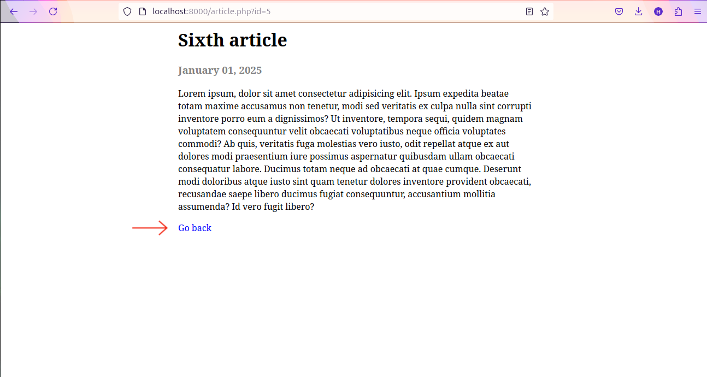

# PHP Personal Blog

> Simple personal blog web application built with HTML, CSS, and PHP.

## Table of Contents

- [General Info](#general-information)
- [Technologies Used](#technologies-used)
- [Features](#features)
- [Setup](#setup)
- [Usage](#usage)
- [Project Status](#project-status)
- [Acknowledgements](#acknowledgements)

## General Information

PHP Personal Blog is a simple web application that used to write and publish articles. This project is designed to explore and practice basic authentication, working with filesystem, HTML, CSS and server in PHP.

## Technologies Used

- HTML
- CSS
- PHP - version 8.3.6

## Features

- **View all articles**: Display a list of all existing articles with their title and publishing date.
- **Admin login**: A basic authentication for the admin section to be able to manage articles.
- **Add new article**: Create a new article with a title, publishing date, and content.
- **View an article**: Display an article with theri title, publishing date, and content.
- **Update an article**: Modify an existing article.
- **Delete an aarticle**: Remove an existing article.

## Setup

To run this CLI tool, you’ll need:

- **PHP**: Version 8.3 or newer

How to install:

1. Clone the repository

   ```bash
   git clone https://github.com/krisnaajiep/php-personal-blog.git
   ```

2. Change the current working directory

   ```bash
   cd path/php-personal-blog
   ```

3. Run the PHP Bult-in server

   ```bash
   php -S localhost:8000
   ```

4. Access the URL
   ```bash
   http://localhost:8000
   ```

## Usage

1. Select `Admin` to enter dashboard.

   

2. Use the following credentials for authentication.

```
Username: admin
Password: password
```

3. Select `+Add` to add new article.

   

4. Fill all input in the add article form and select `Publish` button.

   

5. Select an article title in dashboard to view the content.

   

6. Select `Go back` for return to the previous page.

   

7. Select `Edit` to update an article.

   

8. Fill all input in the edit article form and select `Update` button.

   

9. Select `Delete` to delete an article.

   

## Project Status

Project is: _complete_.

## Acknowledgements

This project was inspired by [roadmap.sh](https://roadmap.sh/projects/personal-blog).
